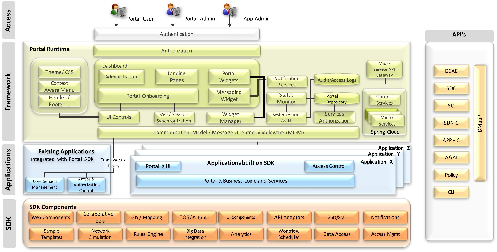
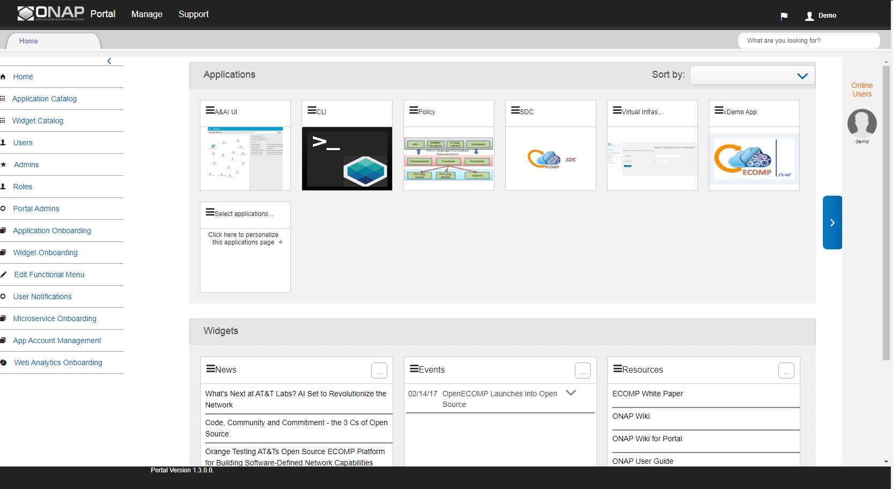

.. This work is licensed under a Creative Commons Attribution 4.0 International License.
.. http://creativecommons.org/licenses/by/4.0

Architecture
------------

.. contents:: 
    :depth: 3

**PORTAL Platform**

The ONAP Portal is a platform that provides the ability to integrate different ONAP applications into a centralized Portal Core. The intention is to allow decentralized applications to run within their own infrastructure while providing common management services and connectivity. The Portal core provides capabilities including application onboarding & management, centralized access management, and hosted application widgets. Using the provided SDK, application developers can leverage the built-in capabilities (Services / API / UI controls) along with bundled tools and technologies.

The Portal provides a web-based user interface that provides access to all of the subsystems of an instance of ONAP. It offers both design-time tools and run-time monitoring and control.

Any user seeking access to an ONAP application will first visit the Portal, where authentication will be performed. Based on the user’s configured access level, the Portal will let the user access different application widgets, and might also redirect the user to a specific run-time environment.

From the Portal, users access applications and Key Performance Indicators. Administrators onboard and manage applications and hosted application widgets, and manage user access.

Here are two views of the Portal landing screen, one for administrators, and one for users:

