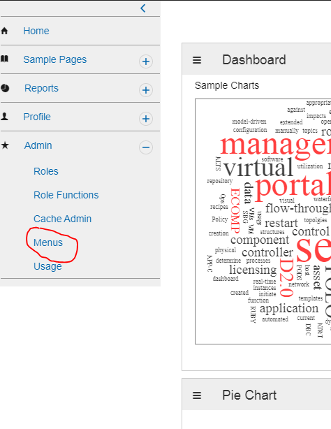
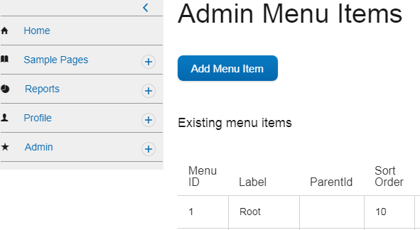
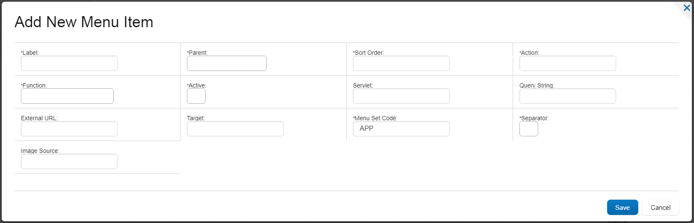

Your AngularJS app
=========================

Now that we've established a database connection, it's time to work on the web side of your app. To start, we'll create some files in :code:`sdk/ecomp-sdk/epsdk-app-os/src/main/webapp/app/fusion/scripts/myapp/myfirstpage`.

myfirstpage.html
----------------

This is your landing page. Its purpose is to pull in all the JavaScript and CSS that your app might need as well as to set up your AngularJS app (:code:`app.js`) and your app's controller (:code:`controller.js`), data-services (:code:`data-service.js`), and routing information (:code:`route.js`) --- more on these in a moment. There is likely much that can be removed from this file (it is boilerplate copied from a sample Portal SDK app), but to save yourself headaches at first, just cut and paste all of it into the :code:`sdk/ecomp-sdk/epsdk-app-os/src/main/webapp/app/fusion/scripts/myapp/myfirstpage/myfirstpage.html` you created earlier in, redundancies and all:

.. code-block:: html

  <!DOCTYPE html>
  <!-- Single-page application for EPSDK-App using DS2 look and feel. -->
  <html>
    <head>
      <meta charset="ISO-8859-1">
      <meta http-equiv="X-UA-Compatible" content="IE=edge, chrome=1" />
      
      <title>Welcome</title>
    
      <!-- B2b Library -->
      <link rel="stylesheet" type="text/css" href="app/fusion/external/b2b/css/b2b-angular/b2b-angular.css">
      <link rel="stylesheet" type="text/css" href="app/fusion/external/b2b/css/b2b-angular/font_icons.css">
        
      <!-- icons in open source -->
      <link rel="stylesheet" type="text/css" href="app/fusion/external/ds2/css/digital-ng-library/ionicons.css">
      <link rel="stylesheet" type="text/css" href="app/fusion/external/ds2/css/digital-ng-library/ecomp-ionicons.css">
      
      <link rel="stylesheet" type="text/css" href="app/fusion/external/angular-bootstrap/ui-bootstrap-csp.css">
      <link rel="stylesheet" type="text/css" href="app/fusion/external/angular-gridster/dist/angular-gridster.min.css">
      <link rel="stylesheet" type="text/css" href="static/fusion/sample/css/scribble.css" />
      <link rel="stylesheet" type="text/css" href="static/fusion/sample/css/welcome.css" />
                                      
      <link rel="stylesheet" type="text/css" href="app/fusion/styles/ecomp.css">
      
      <!-- Common scripts -->  
      
      
      
        
      
      
      
      
      
      
          
      <!-- EPSDK App scripts and common services -->  
      <!-- B2b Library -->
      
      
        
          
         
      
      
      
        
      
      
      
       
        
      
      <!-- Page specific items -->
      
        
        
      
      
    </head>
    <body class="appBody" ng-app="abs">
      <!-- commented the header for now to avoid duplicate headers on portal -->
      

      

      

  
      

   </body>
  </html>

app.js
------

:code:`sdk/ecomp-sdk/epsdk-app-os/src/main/webapp/app/fusion/scripts/myapp/myfirstpage/app.js` contains a single line:

.. code-block:: javascript

  var appDS2=angular.module("abs", ['ngRoute', 'ngMessages','modalServices', 'ngCookies', 'b2b.att','gridster','ui.bootstrap','ui.bootstrap.modal']);

Don't worry too much about the particulars here. Just know that the list of strings are dependencies. You might add or remove some later.

controller.js
-------------

The controller is where most of the action happens. The controller is complex, but there is one basic thing that needs clarifying. In AngularJS, :code:`$scope` essentially says, "This should be visible inside the associated :ref:`template`." You'll gradually come to understand other aspects of the controller as you work with it.

Copy and paste the following into :code:`sdk/ecomp-sdk/epsdk-app-os/src/main/webapp/app/fusion/scripts/myapp/myfirstpage/controller.js`:

.. code-block:: javascript

  appDS2
    .controller('myFirstPageController', function($scope, $routeParams, $location, $interval, $http, $q, $modal, $log, ManifestService, dataService) {
      /**********************************************
       * FUNCTIONS
       **********************************************/
  
      $scope.init = function () {
        // Set up and initialize a state object. This object will contain information about the state of
        // the application as the user interacts with it.
        $scope.state = {
          // Holds a message string for testing
          message: "Hello from myFirstPageController",
        }
      }
    
      /**********************************************
       * Setup and initialize the app on load
       **********************************************/

      $scope.init();

    }); // end .controller

data-service.js
---------------

:code:`data-service.js` is the bridge between the Java side of your app and the web side. The dataService makes http requests to :code:`MyAppController.java`. Once a response is received (it will not block, waiting for a response, because you want your app to continue working while waiting), it executes the :code:`then` portion of the code, which simply returns the result back to wherever it was called from.

We'll see it in action soon. For now copy and paste the following into :code:`sdk/ecomp-sdk/epsdk-app-os/src/main/webapp/app/fusion/scripts/myapp/myfirstpage/data-service.js`:

.. code-block:: javascript

  appDS2.factory('dataService', function ($http, $q, $log) {
    return {
      // Service to return chart data
      getChartData: function(direction) {
        return $http.get("get_chart_data/" + direction + "/").then(function(response) {
          if (typeof response.data === 'object' || typeof response.data === 'string') {
            return response.data;
          }
          else {
            return $q.reject(response.data);
          }
        }, function(response) {
          return $q.reject(response.data);
        })
      }
    };
  });

route.js
--------

:code:`route.js` tells AngularJS how to map specific kinds of incoming requests to specific pages and controllers. AngularJS uses the 'location' hashtag to pass parameters to the client as seen in the commented :code:`when` block example below.

Copy and paste the following into :code:`sdk/ecomp-sdk/epsdk-app-os/src/main/webapp/app/fusion/scripts/myapp/myfirstpage/route.js`:

.. code-block:: javascript

  appDS2.config(function($routeProvider) {
    $routeProvider
 
    // Example route that maps a specific URL to another page and
    // controller.
    // 
    // This would respond to:
    //    http://localhost:8080/epsdk-app-os#/date1/2017-08-01/date2/2017-08-07/
    //
    //.when('/date1/:date1/date2/:date2/', {
    //  templateUrl: 'app/fusion/scripts/myapp/myfirstpage/someotherpage.html',
    //  controller : "anotherController"
    //})
  
    .otherwise({
      templateUrl: 'app/fusion/scripts/myapp/myfirstpage/template.html',
      controller : "myFirstPageController"
    });
  });

.. _template:

template.html
-------------

The AngularJS template holds all the HTML and AngularJS directives that are presented to the user inside the ONAP Portal SDK boilerplate navigation. It is referenced in the :code:`route.js` file. Copy and paste the following into :code:`sdk/ecomp-sdk/epsdk-app-os/src/main/webapp/app/fusion/scripts/myapp/myfirstpage/template.html`:

.. code-block:: html

  

    
{{state.message}}

  

Now, compile, install, and login.

Adding your new page to the SDK navigation
------------------------------------------

First, click on :code:`Menus` in the :code:`Admin` navigation menu:

Now, click the :code:`Add Menu Item` button at the top of the page:

Finally, fill out the form in the following way.

.. note:: "myfirstpage" is a reference to the name we defined in :ref:`definitions.xml`.

To reload the navigation, click :code:`Home` in the Portal SDK navigation menu. You should see your new menu item at the top. If all went well, you should see "Hello from myFirstPageController" in the content area to the right of the navigation menu.

